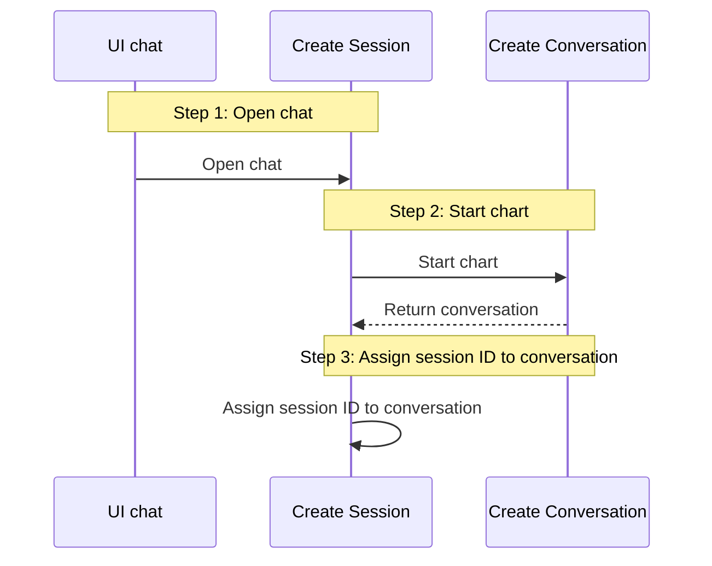
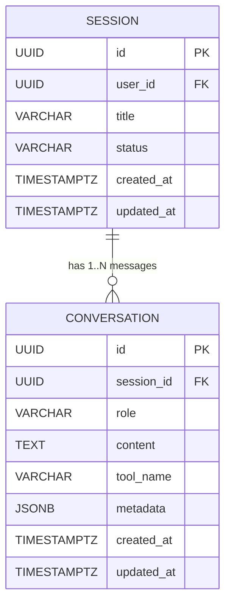

# Architect

## Create Session Flow

```mermaid
sequenceDiagram
    participant UIChat as UI chat
    participant CreateSession as Create Session
    participant CreateConversation as Create Conversation

    Note over UIChat,CreateSession: Step 1: Open chat
    UIChat->>CreateSession: Open chat

    Note over CreateSession,CreateConversation: Step 2: Start chart
    CreateSession->>CreateConversation: Start chart
    CreateConversation-->>CreateSession: Return conversation

    Note over CreateSession,CreateConversation: Step 3: Assign session ID to conversation
    CreateSession->>CreateSession: Assign session ID to conversation
```

## ERD - Entity Relationship Diagram

### Schema Proposal

```mermaid
erDiagram
    SESSION {
        UUID id PK
        UUID user_id FK
        VARCHAR title
        VARCHAR status
        TIMESTAMPTZ created_at
        TIMESTAMPTZ updated_at
    }

    CONVERSATION {
        UUID id PK
        UUID session_id FK
        VARCHAR role
        TEXT content
        VARCHAR tool_name
        JSONB metadata
        TIMESTAMPTZ created_at
        TIMESTAMPTZ updated_at
    }

    SESSION ||--o{ CONVERSATION : "has 1..N messages"
```