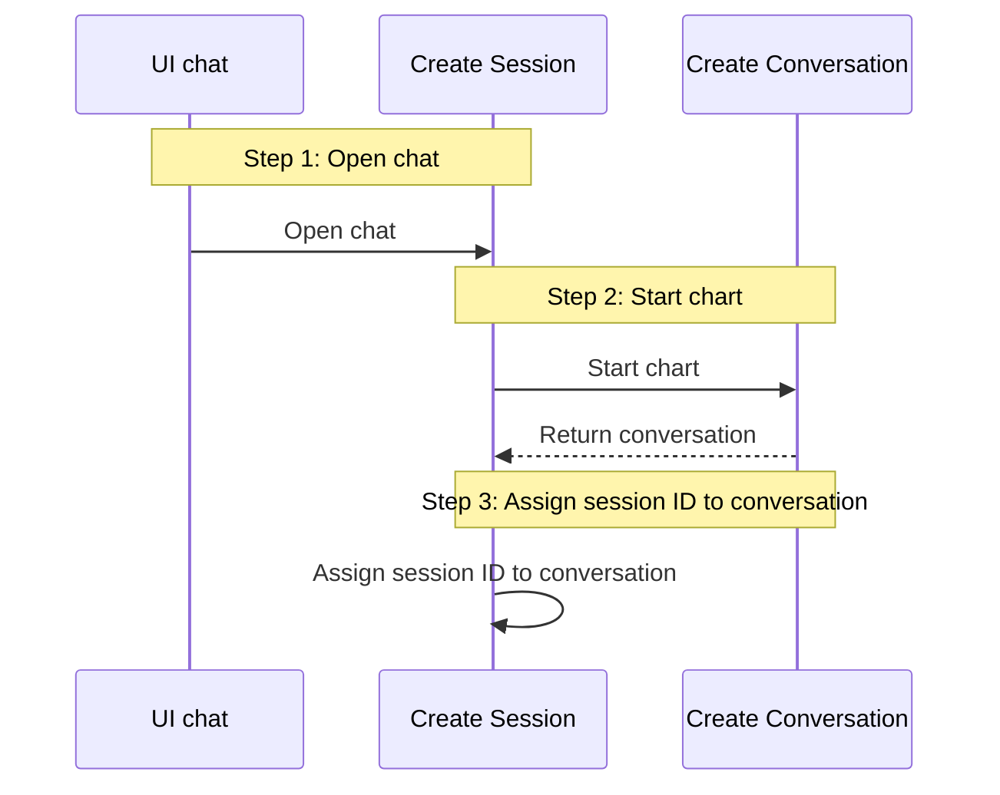

# Architect

## Create Session Flow

```mermaid
sequenceDiagram
    participant UIChat as UI chat
    participant CreateSession as Create Session
    participant CreateConversation as Create Conversation

    Note over UIChat,CreateSession: Step 1: Open chat
    UIChat->>CreateSession: Open chat

    Note over CreateSession,CreateConversation: Step 2: Start chart
    CreateSession->>CreateConversation: Start chart
    CreateConversation-->>CreateSession: Return conversation

    Note over CreateSession,CreateConversation: Step 3: Assign session ID to conversation
    CreateSession->>CreateSession: Assign session ID to conversation
```
