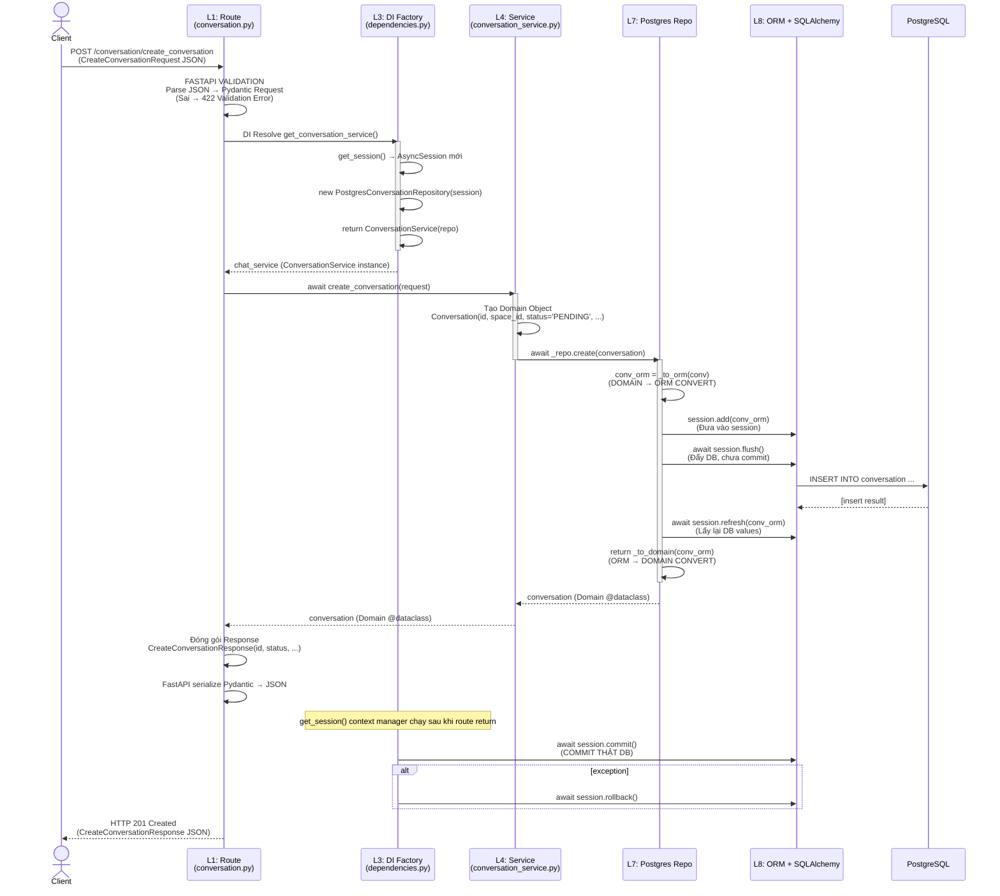

# CRUD Architecture - Tương ứng giữa các file & Cách viết code
---
## 1. Checklist khi viết 1 CRUD hoàn chỉnh

| Check | Câu hỏi |
|---|---|
| ✅ | ORM Model có `__tablename__` đúng không? Column NOT NULL khớp với Domain required? |
| ✅ | Domain `@dataclass` field order: required trước, optional sau? |
| ✅ | Protocol method signatures khớp 100% với Postgres impl? |
| ✅ | `_to_orm` + `_to_domain`: **tất cả field** đều được map? Trùng kiểu? |
| ✅ | Repository method nào cũng gọi `flush()`? Không có `commit()`? |
| ✅ | Service phụ thuộc vào `XxxRepository(Protocol)` thay vì `PostgresXxxRepository`? |
| ✅ | Service nhận schema Request → build Domain object → gọi repo? |
| ✅ | DI factory pattern đúng: `session → PostgresRepo(session) → Service(repo)`? |
| ✅ | Route luôn dùng `Annotated[Service, Depends(get_service)]`? |
| ✅ | Route handler: service trả về Domain object → thủ công map sang Pydantic Response (không return Domain trực tiếp)? |
| ✅ | Router đã được `include_router()` trong `api.py`? |
| ✅ | Alembic migration đã được generate để tạo table mới? |

## 2. Cách viết code CRUD mới (Template theo từng bước)

Để thêm entity mới (ví dụ: `User`), làm đúng 8 bước theo thứ tự **từ trong ra ngoài** (Layer 8 → Layer 1):

### Bước 1: ORM Model (Layer 8)
File `infrastructure/database/orm_models/user.py`:

```python
import uuid
from datetime import date
from sqlalchemy import String
from sqlalchemy.dialects.postgresql import UUID
from sqlalchemy.orm import Mapped, mapped_column

from ai_engineer.infrastructure.database.orm_models.base import Base


class UserORM(Base):
    __tablename__ = 'user'
    id: Mapped[uuid.UUID] = mapped_column(UUID(as_uuid=True), primary_key=True, default=uuid.uuid4)
    name: Mapped[str] = mapped_column(String(255), nullable=False)
    email: Mapped[str] = mapped_column(String(255), nullable=False)
    created_at: Mapped[date] = mapped_column(default=date.today, nullable=False)
```

Sau đó chạy Alembic migration để tạo table.

---

### Bước 2: Domain Model (Layer 5)
File `applications/chatbot/domain/models/user.py`:

```python
from dataclasses import dataclass, field
from datetime import date
import uuid
from typing import Optional


@dataclass
class User:
    id: uuid.UUID
    name: str
    email: str
    created_at: date = field(default_factory=date.today)
```

Quy tắc:
- Dùng `@dataclass` **không** dùng Pydantic cho domain model (tách rời validation layer)
- Required field đứng trước, optional (`Optional[...]` + `= None`) đứng sau
- Date/datetime mặc định: `field(default_factory=...)`

---

### Bước 3: Domain Repository Protocol (Layer 6)
File `applications/chatbot/domain/repositories/user.py`:

```python
from typing import Protocol
import uuid

from ai_engineer.applications.chatbot.domain.models.user import User


class UserRepository(Protocol):
    async def create(self, user: User) -> User: pass
    async def get_by_id(self, user_id: uuid.UUID) -> User | None: pass
    async def update(self, user: User) -> User: pass
    async def delete(self, user_id: uuid.UUID) -> None: pass
    # Thêm method đặc thù:
    # async def get_by_email(self, email: str) -> User | None: pass
```

Quy tắc: Sử dụng `typing.Protocol` (không ABC). Service phụ thuộc vào Protocol này

---

### Bước 4: Postgres Repository (Layer 7)
File `infrastructure/database/repositories/user.py`:

```python
from sqlalchemy import select
from sqlalchemy.ext.asyncio import AsyncSession

from ai_engineer.applications.chatbot.domain.models.user import User
from ai_engineer.infrastructure.dl.orm_models.user import UserORM


class PostgresUserRepository:
    def __init__(self, session: AsyncSession):
        self._session = session

    async def create(self, user: User) -> User:
        user_orm = self._to_orm(user)
        self._session.add(user_orm)
        # KHÔNG commit() - get_session sẽ commit cuối
        await self._session.flush()
        await self._session.refresh(user_orm)
        return self._to_domain(user_orm)

    async def get_by_id(self, user_id: str) -> User | None:
        result = await self._session.execute(
            select(UserORM).where(UserORM.id == user_id)
        )
        orm_obj = result.scalar_one_or_none()
        return self._to_domain(orm_obj) if orm_obj is not None else None

    async def update(self, user: User) -> User:
        result = await self._session.execute(
            select(UserORM).where(UserORM.id == user.id)
        )
        orm_obj = result.scalar_one_or_none()
        if orm_obj is None:
            raise ValueError(f"User {user.id} not found")
        orm_obj.name = user.name
        orm_obj.email = user.email
        await self._session.flush()
        await self._session.refresh(orm_obj)
        return self._to_domain(orm_obj)

    async def delete(self, user_id: str) -> None:
        result = await self._session.execute(
            select(UserORM).where(UserORM.id == user_id)
        )
        orm_obj = result.scalar_one_or_none()
        if orm_obj is not None:
            await self._session.delete(orm_obj)
            await self._session.flush()

    # ── 2-way converter (BẮT BUỘC) ──────────────────────────
    def _to_orm(self, user: User) -> UserORM:
        return UserORM(
            id=user.id,
            name=user.name,
            email=user.email,
            created_at=user.created_at,
        )

    def _to_domain(self, orm_obj: UserORM) -> User:
        return User(
            id=orm_obj.id,
            name=orm_obj.name,
            email=orm_obj.email,
            created_at=orm_obj.created_at,
        )
```

Quy tắc BẮT BUỘC:
- Luôn có `_to_orm()` + `_to_domain()` mapping **từng field 1**
- Sử dụng `flush()` + `refresh()` (không `commit()`)
- Select 1 bản ghi: `result.scalar_one_or_none()`
- Select nhiều: `result.scalars().all()` → list comprehension `[self._to_domain(x) for x in ...]`
- **Kiểu dữ liệu đặc biệt** (JSON, list[dict]): cần serialize/deserialize trong converter (xem `PostgresLLMResponseRepository._serialize_attachments`)

---

### Bước 5: Service (Layer 4)
File `applications/chatbot/service/user_service.py`:

```python
import uuid
from datetime import date

from ai_engineer.applications.chatbot.domain.models.user import User
from ai_engineer.applications.chatbot.domain.repositories.user import UserRepository


class UserService:
    def __init__(self, user_repository: UserRepository):
        self._user_repository = user_repository   # Phụ thuộc vào PROTOCOL, không Postgres cụ thể

    async def create_user(self, request) -> User:
        user = User(
            id=request.id,
            name=request.name,
            email=request.email,
            created_at=date.today(),
        )
        return await self._user_repository.create(user)

    async def get_by_id(self, user_id: uuid.UUID) -> User | None:
        return await self._user_repository.get_by_id(user_id)

    # Thêm business logic: validation, transform trước khi gọi repo
    # async def create_user_from_dto(self, dto):
    #     if '@' not in dto.email: raise ValueError("Invalid email")
    #     ...
```

Quy tắc:
- Service constructor nhận **Protocol (interface)**, không nhận `PostgresUserRepository` trực tiếp
- Service **chỉ** làm business logic (validation, transform, gọi nhiều repo trong 1 transaction)
- Service không biết tới SQLAlchemy, không biết tới Postgres

---

### Bước 6: Pydantic Schemas (Layer 2)
File `backend/schemas/user.py`:

```python
from datetime import date
from pydantic import BaseModel, Field, EmailStr
from uuid import UUID
from typing import Optional


class CreateUserRequest(BaseModel):
    id: UUID
    name: str
    email: str   # hoặc EmailStr nếu có pydantic[email]
    created_at: date = Field(default_factory=date.today)


class CreateUserResponse(BaseModel):
    id: UUID
    name: str
    email: str
    created_at: date


class GetUserResponse(CreateUserResponse):
    pass
```

Quy tắc:
- Tách Request và Response (dù giống nhau): để sau mở rộng (vd Request không trả về id)
- Dùng `Field(default_factory=date.today)` cho auto field
- Request body luôn có `id: UUID` (client sinh ID, không phụ thuộc DB generate)

---

### Bước 7: DI Factory (Layer 3)
Thêm vào [backend/dependencies.py](file:///Users/tuongnguyen/Desktop/projects/finance_ai_platform/finance-ai-engineer/ai_engineer/applications/chatbot/backend/dependencies.py):

```python
from ai_engineer.applications.chatbot.service.user_service import UserService
from ai_engineer.infrastructure.database.repositories.user import PostgresUserRepository


def get_user_service(
    session: Annotated[AsyncSession, Depends(get_session)],
) -> UserService:
    user_repository = PostgresUserRepository(session)
    return UserService(user_repository)
```

Quy tắc:
- **Không** dùng `@lru_cache` cho service cần DB session (mỗi request session khác nhau → service mới)
- Pattern chuẩn: `session → PostgresXxxRepository(session) → XxxService(repo)`

---

### Bước 8: Route (Layer 1)
File `backend/routes/user.py`:

```python
from typing import Annotated
from uuid import UUID
from fastapi import APIRouter, Depends

from ai_engineer.applications.chatbot.backend.schemas.user import (
    CreateUserRequest, CreateUserResponse, GetUserResponse,
)
from ai_engineer.applications.chatbot.service.user_service import UserService
from ai_engineer.applications.chatbot.backend.dependencies import get_user_service


router = APIRouter(prefix="/user", tags=["User"])


@router.post("/create_user", status_code=201)
async def create_user(
    request: CreateUserRequest,
    user_service: Annotated[UserService, Depends(get_user_service)],
) -> CreateUserResponse:
    user = await user_service.create_user(request)
    return CreateUserResponse(
        id=user.id,
        name=user.name,
        email=user.email,
        created_at=user.created_at,
    )


@router.get("/user/{user_id}", status_code=200)
async def get_user(
    user_id: UUID,
    user_service: Annotated[UserService, Depends(get_user_service)],
) -> GetUserResponse:
    user = await user_service.get_by_id(user_id)
    if user is None:
        from fastapi import HTTPException
        raise HTTPException(status_code=404, detail="User not found")
    return GetUserResponse(
        id=user.id,
        name=user.name,
        email=user.email,
        created_at=user.created_at,
    )
```

Sau đó đăng ký router vào [api.py](file:///Users/tuongnguyen/Desktop/projects/finance_ai_platform/finance-ai-engineer/ai_engineer/applications/chatbot/backend/api.py):

```python
from .routes import conversation, health, llm_response, message, rag, ai_chat, user

app.include_router(user.router)
```

## 3. Luồng đi khi gọi 1 API CRUD (ví dụ: create_conversation)



**Quan trọng**: `session.flush()` trong repo đẩy SQL nhưng **chưa commit** – commit thật được thực hiện ở `get_session()` context manager (Layer 3) sau khi route handler return thành công.

---

## 4. Session Lifecycle (Quản lý DB connection)

File: [infrastructure/database/session.py](file:///Users/tuongnguyen/Desktop/projects/finance_ai_platform/finance-ai-engineer/ai_engineer/infrastructure/database/session.py)

```
get_session_factory()           → singleton async_sessionmaker (bind=engine)
        │
        ▼
get_session()                   → FastAPI dependency, AsyncGenerator
    async with session_factory() as session:
        try:
            yield session        ← NHẢY VÀO route + service + repo
            await session.commit() ← SAU KHI route return OK
        except Exception:
            await session.rollback() ← CÓ LỖI thì rollback
            raise
```

- **1 request = 1 AsyncSession**: Mỗi HTTP request có 1 session riêng, tự đóng sau khi xong
- **@lru_cache(maxsize=1)** cho session factory: engine + sessionmaker tạo 1 lần duy nhất
- **Auto-commit on success**: Không cần gọi `commit()` trong repo/service

---

