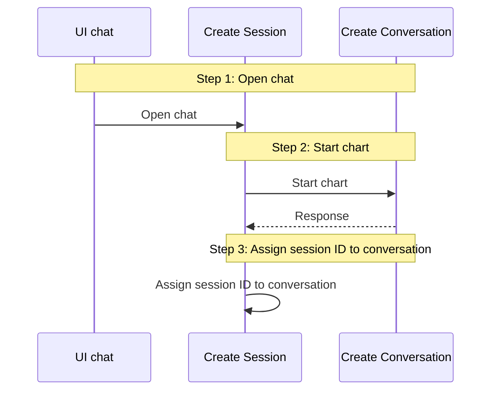

+ Here is most simplest chat flow for users:
Step 1: User open chatbot page
- Check conversation exist or not
- If not, create new conversation and session
- If exist, continue with existing conversation only creating new session

## Chatbot flow sequence

