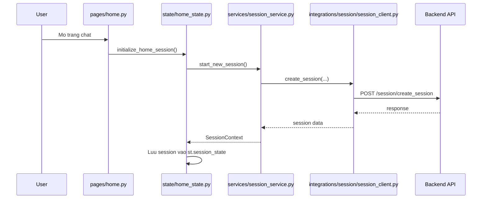

# FE gọi BE trong `ai_chatbot`

## 1. Phạm vi tài liệu

Tài liệu này mô tả cách viết code cho frontend gọi xuống backend

- FE muốn gọi backend thì luồng phía frontend sẽ đi như thế nào
- Cần update những file nào ở phía frontend

Note: Không mô tả backend.

## 2. Luồng hiện tại phía frontend
Ví dụ:
Hiện tại trong `ai_engineer/ai_chatbot`, FE mới gọi backend ở bước tạo session khi mở trang chat.

Flow hiện tại:



Các file FE đang tham gia trong flow này:

- `ai_engineer/ai_chatbot/pages/home.py`
- `ai_engineer/ai_chatbot/state/home_state.py`
- `ai_engineer/ai_chatbot/services/session_service.py`
- `ai_engineer/ai_chatbot/integrations/session/session_client.py`
- `ai_engineer/ai_chatbot/config.py`

## 3. Khi FE muốn gọi backend thì nên đi theo luồng nào

Về mặt frontend, luồng chuẩn nên là:

```text
Page/UI -> State -> Service -> Integration Client -> Backend
```

Ý nghĩa từng tầng:

- `pages/`: bắt event từ UI như mở trang, submit prompt, click button
- `state/`: giữ `st.session_state`, loading, error, ids, chat history
- `services/`: orchestration flow gọi API
- `integrations/`: nơi gọi HTTP thật tới backend
- `config.py`: quản lý base URL, timeout, secrets

## 4. Để gọi backend đúng luồng thì cần update file nào

Đây là case đang có sẵn trong code.

### 4.1 Bước 1: Update `base_url` config nếu cần

Update:

- `ai_engineer/ai_chatbot/config.py`
- `.streamlit/secrets.toml` của app

### 4.2: Bước 2: Create client trong integrations
Client chịu trách nhiệm gọi tới backend

Ví dụ để implement code gọi tới backend cho conversation:
- `ai_engineer/ai_chatbot/integrations/conversation/conversation_client.py`

### 4.3: Bước 3: Create service trong services
Service chịu trách nhiệm orchestration flow gọi API

Ví dụ để implement code gọi tới backend cho chat:
- `ai_engineer/ai_chatbot/services/chat_service.py`

### 4.4: Bước 4: Create state
State chịu trách nhiệm quản lý state của FE cho từng page. Tuy nhiên chúng ta cần thêm vào state khi tạo đối
tượng mới

Ví dụ để implement code quản lý state của FE:
- `ai_engineer/ai_chatbot/state/home_state.py`

### 4.5: Bước 5: Update pages/home.py
Update pages/ để thêm vào phần state vừa tạo, cũng như những logic liên quan

- `ai_engineer/ai_chatbot/pages/home.py

### Nên thêm mới ở `services/`

Nên tạo một service orchestration riêng, ví dụ:

- `ai_engineer/ai_chatbot/services/chat_service.py`

## 5. Kết luận ngắn

Nếu chỉ nhìn từ phía frontend, câu trả lời ngắn là:

- Luồng nên đi theo `pages -> state -> services -> integrations -> backend`
- Nếu muốn FE gửi chat thật, file cần sửa chủ yếu nằm ở:
  - `pages/home.py`
  - `state/home_state.py`
  - `services/`
  - `integrations/`
  - `config.py`
